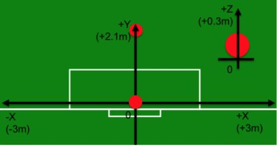

# Supervised learning - Polynomial regression
### Regressão linear para prever o posicionamento em que uma bola atingirá o gol em um jogo de futebol
###### Código desenvolvido na disciplina MC866 - Machine Learn

Regressão Linear é um método de aprendizagem supervisionada em que um algoritmo é treinado para prever uma saída a partir de uma faixa contínua de valores possíveis, nesse caso, dado alguns posicionamentos de uma bola o algoritimo monta uma regressão polinomial com o comportamento analisado, visando encontrar os posicionamentos futuro da bola. Como fonte de dados foi usado dois arquivos, onde cada um representa um "chute" na bola. 
Na pasta Kick1 e Kick2 se encontram, respectivamente, os resultados para analise dos chutes(dados) 1 e 2. Usando as bibliotecas numpy e matlotlib foram plotados os pontos em vermelho, relacionando x a y e z a y, uma vez que temos como objetivo entender o comportamento da bola no eixo y, visto que buscamos identificar x e z quando a bola atingir o gol (y = 0 )

Nas imagens geradas como resultado é possível ver a regressão polonomial que o algoritimo chegou. O titulo da imagem representa algumas informações a serem consideradas sendo:
Set **A** - **E** - **N** onde :
- **A** corresponde ao alpha usado para a regressão polinomial
- **E** corresponde ao eixo analizado em relação a y (x ou z)
- **N** corresponde se houve ou não normalização dos dados antes de serem processados (Norm ou semNorm)
